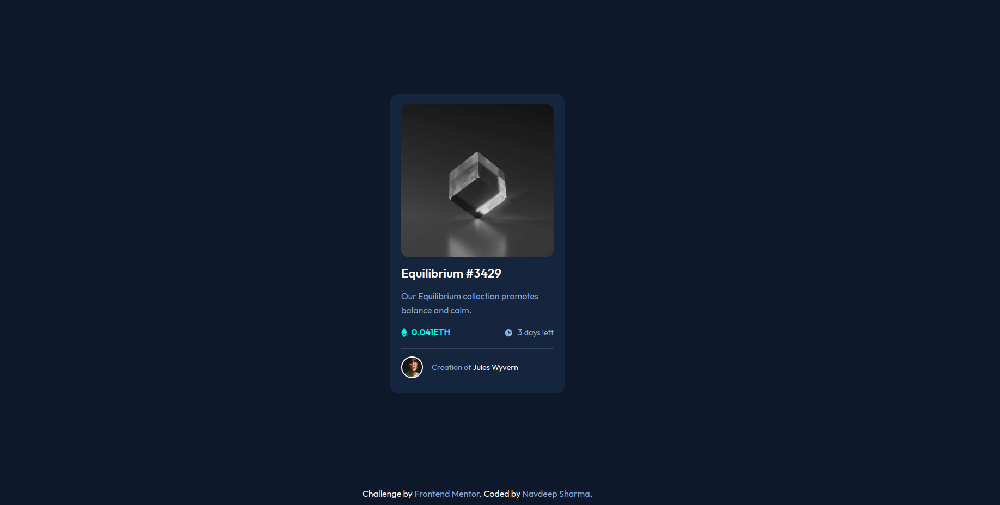

# Frontend Mentor - NFT preview card component solution

This is a solution to the [NFT preview card component challenge on Frontend Mentor](https://www.frontendmentor.io/challenges/nft-preview-card-component-SbdUL_w0U). Frontend Mentor challenges help you improve your coding skills by building realistic projects. 

## Table of contents

- [Overview](#overview)
  - [The challenge](#the-challenge)
  - [Screenshot](#screenshot)
  - [Links](#links)
- [My process](#my-process)
  - [What I learned](#what-i-learned)
  - [Continued development](#continued-development)
- [Author](#author)

**Note: Delete this note and update the table of contents based on what sections you keep.**

## Overview

### The challenge

Users should be able to:

- View the optimal layout depending on their device's screen size
- See hover states for interactive elements

### Screenshot




### Links

- Solution URL: [Add solution URL here](https://github.com/honey150/nft-preview-card.git)
- Live Site URL: [Add live site URL here](https://honey150.github.io/nft-preview-card/)

## My process

### Built with

- Semantic HTML5 markup
- CSS custom properties
- Flexbox
- @keyframes for animation
- Applying BEM convention for CSS class


### What I learned

Through this project, I’ve learned how to effectively use Flexbox. I’ve also utilized the width property well to ensure that my webpage remains responsive. I’ve had a great experience working with CSS custom variables and plan to continue using them in the future. The projects from Frontend Mentor have been very valuable and are accelerating my growth in frontend development.

```html
<h1>Some HTML code I'm proud of</h1>
<section class="crypto-card">
      <div class="crypto-card__img">
        
        <div class="view-img">
          
        </div>
      </div>
      <div class="crypto-card__description">
        <div class="crypto-card__title">Equilibrium #3429</div>
        <div class="crypto-card__para">
          Our Equilibrium collection promotes balance and calm.
        </div>
        <div class="crypto-type">
          <div class="eth-crypto">
            <span
              ></span>
            <span>0.041ETH</span>
          </div>
          <div class="time-left">
            <span></span>
            <span>3 <span class="days-count">days left</span></span>
          </div>
        </div>
        <div class="divider"></div>
        <div class="crypto-card__designer">
          
          <p><span>Creation of</span> Jules Wyvern</p>
        </div>
      </div>
    </section>
```
```css
/* My CSS */
@import url("https://fonts.googleapis.com/css2?family=Outfit:wght@100..900&display=swap");

:root {
  --clr-primary: hsl(215, 51%, 70%);
  --clr-primary-cyan: hsl(178, 100%, 50%);

  --main-bg: hsl(217, 54%, 11%);
  --card-bg: hsl(216, 50%, 16%);
  --line-clr: hsl(215, 32%, 27%);
  --white-clr: hsl(0, 0%, 100%);

  --ff-primary: "Outfit", "sans-serif";

  --fw-300: 300;
  --fw-400: 400;
  --fw-600: 600;

  --fs-title: 1.4rem;
  --fs-primary: 1rem;
}

*,
*::before,
*::after {
  margin: 0;
  padding: 0;
  box-sizing: border-box;
}

body {
  width: 100%;
  min-height: 100vh;
  font-family: var(--ff-primary);
  background-color: var(--main-bg);
  display: flex;
  flex-direction: column;
}

.crypto-card {
  margin: auto;
  max-width: 320px;
  background-color: var(--card-bg);
  border-radius: 1rem;
  padding: 1.25rem;
}

.crypto-card__img {
  position: relative;
  overflow: hidden;
  border-radius: 0.8rem;
  margin-bottom: 1rem;
  width: 280px;
  height: 280px;
}

.crypto-card__img img {
  position: relative;
  width: 100%;
  height: 100%;
  border-radius: 0.5rem;
  display: block;
  margin: 0 auto 1.25rem;
  transition: filter 0.2s ease-in;
  filter: grayscale(100%);
}

.crypto-card__img > img:hover {
  filter: grayscale(0%);
}

.view-img {
  position: absolute;
  width: 100%;
  height: 100%;
  background-color: hsla(178, 100%, 50%, 0.3);
  inset: 0;
  border-radius: 0.5rem;
  transform: translateX(101%);
  z-index: 5;
}

.view-img.active {
  animation: swipe-left 0.3s ease-in forwards;
}

.view-img.unactive {
  animation: swipe-right 0.3s ease-in forwards;
}

.view-img .eye-icon {
  position: absolute;
  inset: 0;
  margin: auto;
  width: 2rem;
  height: 2rem;
}

.crypto-card__title {
  font-size: var(--fs-title);
  color: var(--white-clr);
  font-weight: var(--fw-600);
}

.crypto-card__para {
  margin: 1rem 0;
  font-size: var(--fs-primary);
  color: var(--clr-primary);
  font-weight: var(--fw-400);
  line-height: 1.6rem;
}

.crypto-type,
.crypto-card__designer {
  display: flex;
  justify-content: space-between;
  align-items: center;
  margin-bottom: 1.25rem;
}

.eth-crypto,
.time-left {
  display: flex;
  align-items: center;
  gap: 0.5rem;
  color: var(--clr-primary);
}

.eth-crypto {
  color: var(--clr-primary-cyan);
  font-weight: var(--fw-600);
}

span > img {
  vertical-align: middle;
}

.days-count {
  font-size: 0.9rem;
}

.divider {
  width: 100%;
  height: 2px;
  background-color: var(--line-clr);
}

.crypto-card__designer {
  justify-content: flex-start;
  gap: 1rem;
  margin: 0.8rem 0 0.5rem;
  font-size: 0.9em;
}

.crypto-card__designer img {
  width: 2.5rem;
  height: 2.5rem;
  border-radius: 50%;
  border: 2px solid var(--white-clr);
}

.crypto-card__designer > p {
  color: var(--white-clr);
}

.crypto-card__designer > p > span {
  color: var(--clr-primary);
}

.attribution {
  color: var(--white-clr);
  width: clamp(325px, 80vw, 1200px);
  text-align: center;
  margin: 0 auto 1rem;
}

.attribution a {
  color: var(--clr-primary);
  text-decoration: none;
}

@keyframes swipe-left {
  0% {
    transform: translateX(101%);
  }
  100% {
    transform: translateX(0%);
  }
}

@keyframes swipe-right {
  0% {
    transform: translateX(0%);
  }
  100% {
    transform: translateX(101%);
  }
}

```
```js
// My JS Code

  let cardImage = document.querySelector(".crypto-card__img")
      let viewIcon = document.querySelector(".view-img");
      cardImage.addEventListener("click", () => {
        viewIcon.classList.add("active")
        viewIcon.classList.remove("unactive")
        
      })

      viewIcon.addEventListener("click", (e) => {
        e.stopPropagation();
        console.log("view icon cliked")
        viewIcon.classList.add("unactive")
        viewIcon.classList.remove("active")
      })
```


### Continued development


I still have much to learn in my CSS journey. I aim to master typography, layouts, and responsiveness, and I also want to explore utility tools related to CSS, such as Tailwind and Sass.


## Author

- Website - [Add your name here](https://www.your-site.com)
- Frontend Mentor - [@honey150](https://www.frontendmentor.io/profile/honey150)
- Github - [@honey150](https://github.com/honey150)
- Instagram - [@honeysharma216/](https://www.instagram.com/honeysharma216/)


